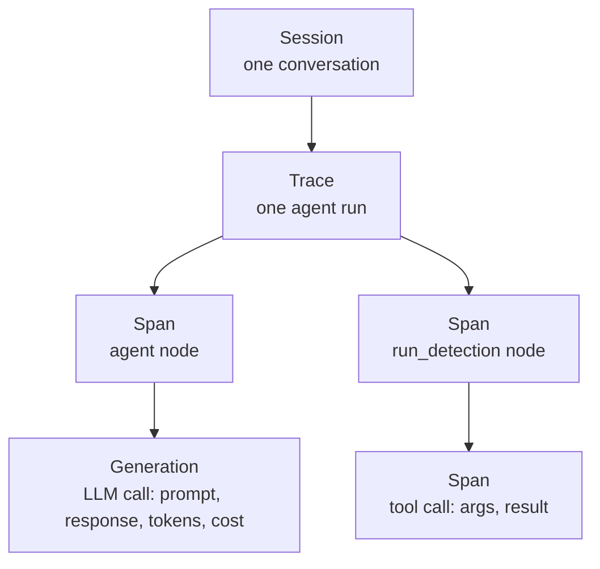

# Agent Observability with Langfuse

Your LangGraph agent is running in production. A user reports: *"it blurred the whole image instead of just the person."*

What do you do? Read the logs?

```text
INFO:  POST /chat 200
INFO:  tool call: blur_image
```

That tells you *something happened*. It doesn't tell you what the model saw, which prompt produced that decision, how many tokens it burned, or why `detect_objects` was never called.

LLM applications are non-deterministic - the same input can take a different path on every run.

You need **observability**: a full recording of every step - prompts, tool calls, latency, cost, and output.


## What is Langfuse

[Langfuse](https://github.com/langfuse/langfuse) is an open-source LLM engineering platform. It gives you three things:

**Observability** - log traces of every agent run. See the exact prompt, the model response, the tool arguments, the latency and the cost of each step.

**Prompts** - version prompts outside your code, deploy a new version without redeploying the app, and compare versions against each other.

**Evaluation** - score outputs (manually, by an LLM judge, or from user feedback), monitor quality in production, and catch regressions before they ship.


## Architecture

![][ai_langfuse_arch]

The stack has a few moving parts:

- **Web** - the UI, and the ingestion API your SDK sends events to.
- **Worker** - consumes queued events asynchronously, so tracing never blocks your agent.
- **Postgres** - transactional data (users, projects, prompts, API keys).
- **ClickHouse** - traces and observations (high-volume, append-only).
- **Redis** - event queue and cache.
- **S3 / MinIO** - raw event payloads and large blobs.


## Deployment

Langfuse is self-hostable anywhere:

- **Cloud providers** (AWS, GCP, Azure) - using the official Terraform modules.
- **Kubernetes** - using the official Helm chart.
- **Locally** - using Docker Compose.

Let's start locally:

```bash
git clone https://github.com/langfuse/langfuse.git
cd langfuse
docker compose up -d
```

> [!WARNING]
> The secrets in `docker-compose.yml` are development defaults. Change `NEXTAUTH_SECRET`, `SALT` and `ENCRYPTION_KEY` before exposing Langfuse to anyone else.

Watch the containers start and the logs flow in. After about 2-3 minutes the `langfuse-web-1` container logs `Ready`.

Open http://localhost:3000, create an account, an organization and a project, then generate API keys under **Settings → API Keys**.

Store them in a `.env` file next to your agent:

```text
LANGFUSE_PUBLIC_KEY=pk-lf-...
LANGFUSE_SECRET_KEY=sk-lf-...
LANGFUSE_HOST=http://localhost:3000
```


## Instrumenting Your LangGraph Agent

Langfuse integrates [with most AI frameworks](https://langfuse.com/integrations#frameworks) - LangChain, LangGraph, the OpenAI SDK, LlamaIndex, or plain Python decorators.

For LangGraph, instrumentation is a **callback handler**. The graph already emits an event for every node, LLM call and tool call - the handler turns each one into a Langfuse observation. Your graph doesn't change.

```bash
pip install langfuse
```

Run this simple chat agent:

```python
import uuid
from typing import Annotated

from dotenv import load_dotenv
from typing_extensions import TypedDict

# Load env vars BEFORE importing Langfuse, so the client picks up the credentials.
load_dotenv()

from langchain_core.messages import AIMessage, HumanMessage
from langchain.chat_models import init_chat_model
from langgraph.graph import StateGraph, START, END
from langgraph.graph.message import add_messages

from langfuse import get_client, propagate_attributes
from langfuse.langchain import CallbackHandler


class State(TypedDict):
    messages: Annotated[list, add_messages]


llm = init_chat_model(
    "us.anthropic.claude-haiku-4-5-20251001-v1:0",
    model_provider="bedrock_converse",
    region_name="us-east-1",
)


def chatbot(state: State) -> State:
    response = llm.invoke(state["messages"])
    return {"messages": [response]}


graph_builder = StateGraph(State)
graph_builder.add_node("chatbot", chatbot)
graph_builder.add_edge(START, "chatbot")
graph_builder.add_edge("chatbot", END)
graph = graph_builder.compile()


def main() -> None:
    langfuse = get_client()
    if not langfuse.auth_check():
        print("Langfuse authentication failed - check your LANGFUSE_* env vars.")
        return

    # The callback handler is what turns every LangGraph/LangChain step into a trace.
    langfuse_handler = CallbackHandler()

    # One session id per run
    session_id = str(uuid.uuid4())
    history: list[HumanMessage | AIMessage] = []

    print("Chat with the agent (Ctrl+C or empty line to quit).\n")
    while True:
        user_input = input("You: ").strip()
        if not user_input:
            break

        history.append(HumanMessage(content=user_input))

        # propagate_attributes sets trace-level metadata on everything created inside.
        with propagate_attributes(
            trace_name="simple-langgraph-chat",
            session_id=session_id,
            tags=["simple-agent"],
        ):
            result = graph.invoke(
                {"messages": history},
                config={
                    "callbacks": [langfuse_handler],
                    "run_name": "handle-chat-message",
                },
            )

        answer = result["messages"][-1]
        history = result["messages"]
        print(f"Bot: {answer.content}\n")

    # Short-lived script: make sure queued events are sent before exiting.
    langfuse.flush()


if __name__ == "__main__":
    main()
```

Chat for a few turns, then open **Tracing → Traces** in the Langfuse UI.

> [!NOTE]
> Events are sent in the background, in batches. In a long-running service (FastAPI, for example) you don't flush per request - only on shutdown. In a short script you must, otherwise the process exits before the queue is drained.


## Reading a Trace

Langfuse organizes what it records in a small hierarchy:



- **Trace** - one end-to-end run of your agent (one user request).
- **Observation** - a single step inside a trace. A **span** is any unit of work (a graph node, a tool call); a **generation** is a span that called an LLM, so it also records the model, prompt, completion, token counts and cost.
- **Session** - groups traces belonging to the same conversation. Pass a stable `session_id` - in a LangGraph app, your `thread_id` is a natural fit.
- **Tags & metadata** - arbitrary labels for filtering (`prod`, `simple-agent`, an experiment name).
- **Score** - a quality number attached to a trace: a thumbs-up from the user, an LLM-judge rating, or a manual review.

Open a trace and you can answer the question we started with: which node ran, what the model actually received, which tool it chose, and what it cost.


## Exercises

### :pencil2: Langfuse Skills

Install the official Langfuse agent skills:

```bash
npx skills add langfuse/skills --skill "langfuse"
```

Then ask your coding agent:

```text
Add tracing to this application with Langfuse following best practices.
```

Review the diff carefully - compare what the agent produced against the instrumentation you wrote by hand.

### :pencil2: Trace Your Agent

Instrument the PolyAI vision agent (`services/agent/app.py`) with Langfuse:

1. Add the callback handler to the graph invocation in your `/chat` endpoint.
2. Use the LangGraph `thread_id` as the Langfuse `session_id`, so a multi-turn conversation shows up as a single session.
3. Tag traces with the environment (`dev` / `prod`).

Send a multi-step request (*"blur the person, then rotate 90°"*) and verify in the UI that you see one session, several traces, and the tool calls nested under the agent node.


### :pencil2: Cost per Conversation

Using the Langfuse dashboard, find:

- The most expensive trace of the last 24 hours.
- The average latency of your `agent` node.
- The total token usage per model.

Then reduce the cost of that trace - trim the system prompt, or stop sending the full conversation history on every turn - and compare the traces before and after.


### :pencil2: User Feedback as a Score

Add a `POST /feedback` endpoint to your agent service that accepts a `trace_id` and a rating (`1` for 👍, `0` for 👎), and reports it to Langfuse:

```python
langfuse.create_score(trace_id=trace_id, name="user-feedback", value=rating)
```

Return the `trace_id` from `/chat` so the client can echo it back. Then filter traces by low scores in the UI - that's your debugging queue.


[ai_langfuse_arch]: https://exit-zero-academy.github.io/DevOpsTheHardWayAssets/img/langfuse_arch.png 

