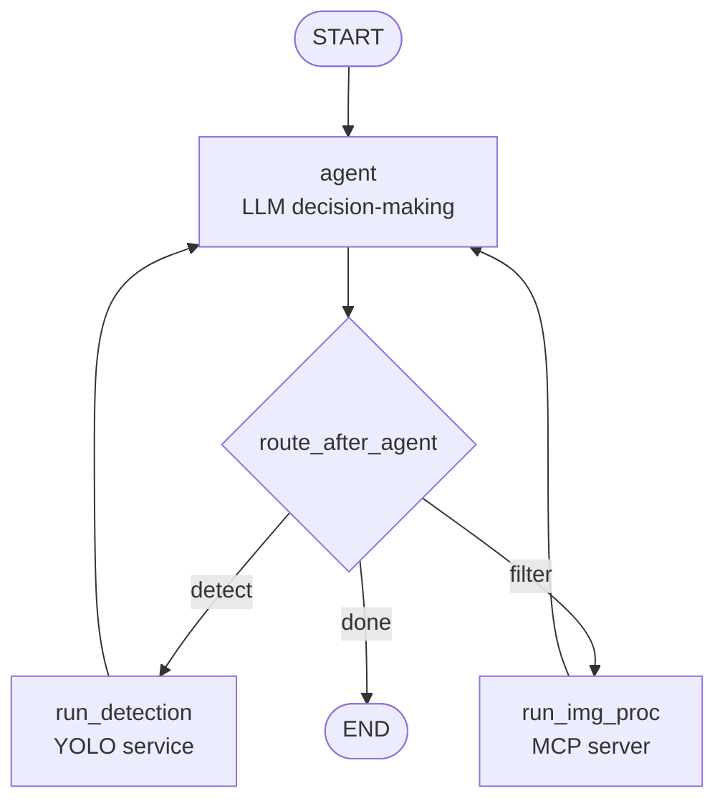

# AI Agents with LangGraph

In the previous tutorial you built a working agentic loop. As the task grows more complex, cracks appear.

### Hallucination

The agent responds *"I blurred the person in the image"* - but no tool was called. The model just said it did the work.

Or worse: it *did* call `blur_image` - but on the whole image, without bounding box data, because it skipped `detect_objects`. The user asked to blur a specific person; the agent blurred everything.

The natural fix is to add rules to the system prompt:

```
When the user refers to a specific object, call detect_objects first.
Only call blur_image with bounding box coordinates from a prior detection.
```

The agent still gets it wrong. These are just words. **You cannot enforce a workflow through a system prompt.**

### Conversation state

- Your agent crashes mid-task. State lives in Python variables - it's gone. Everything reruns from scratch.

- A user sends: *"Actually, don't blur anyone."*

  The blur is already applied and the original image is gone from context. The user has to resend it and re-specify every operation they still want. You've hit this in the PolyAI stack: tweak one filter, rebuild the whole request.

- A user asks: *"Before removing that person, show me a preview."*

  A `while` loop runs to completion or it doesn't. It can't pause and wait for a human - a graph can.

- *"Blur every child in this image except the one wearing red."*

  In a chain, the LLM must figure out the entire sequence through tool calls alone. Every complex request becomes a prompt engineering problem.


## The Transition

All of these problems share a root cause: **the LLM is responsible for controlling execution.**

The model looks at the conversation history and guesses the right next step. Most of the time it guesses correctly - but "most of the time" is not a guarantee.

LangGraph flips this. You define the structure. The LLM decides *what* to do. The graph decides *how execution flows*.

Detection must happen before filtering? Make it a graph edge - the LLM can't reach the filter node without passing through detection first. The model no longer needs to "remember" the rule; it's physically unreachable to violate it.

Two kinds of requests hit the PolyAI image pipeline:

- **Whole-image ops** - "rotate 90°", "flip horizontally". No detection needed.
- **Object-specific ops** - "blur the person", "crop the dog". Require bounding boxes from YOLO first.

In a chain, the LLM decides freely. Nothing stops it from calling `blur_image` on a "blur the person" request without ever running `detect_objects` - and the filter silently applies to the whole image.


## Thinking in LangGraph

LangGraph models an agent as a **stateful directed graph**. Building one always follows five steps.

Your product team has given you these requirements for the PolyAI vision assistant:

- Accept an image from the user
- Answer questions about image content ("how many people are in this image?")
- Apply filters to the image (whole or object-specific) - blur, rotate, flip, crop, add noise
- Support multi-step edits in a single conversation ("now rotate it 90°")
- Allow the user to undo or change a filter without resending the image
- Ask for confirmation before applying destructive operations

### Step 1: Map Your Workflow as Discrete Steps

Identify the distinct operations in your process. Each becomes a **node** - a function that does one thing. Sketch how they connect.

For the PolyAI vision agent:



Some nodes always go to the same next node (static edges). Others decide based on state (conditional edges). The router can inspect `state["detections"]` to decide which path to take - that logic lives in your code, not in a prompt.

### Step 2: Identify What Each Step Needs to Do

For each node, ask: what kind of operation is this?

- **LLM step** - needs to understand, reason, or generate text
- **Data step** - needs to fetch from an external service (YOLO, a database)
- **Action step** - performs a real-world action (apply a filter, write to disk)
- **Human input step** - needs to pause and wait for a person

This tells you how to implement it and handle failures: LLM calls may need retries, action steps shouldn't be cached, human input steps pause indefinitely.

### Step 3: Design Your State

State is the shared notebook all nodes read from and write to. Every node receives it, does work, and returns updates.

```python
from typing import Annotated, Optional
from typing_extensions import TypedDict
from langgraph.graph.message import add_messages
import operator

class VisionState(TypedDict):
    messages:        Annotated[list, add_messages]  # full conversation history
    image_key:       Optional[str]                  # S3 key of the original image
    detections:      Optional[dict]                 # YOLO output - never needs re-running
    processed_keys:  Annotated[list, operator.add]  # S3 keys of each processed version, newest last
    tools_called:    Annotated[list, operator.add]  # audit trail
```


### Step 4: Build Your Nodes

A node is a Python function: takes state, returns a partial update.

```python
from langchain_core.messages import ToolMessage
import json

def agent_node(state: VisionState) -> dict:
    response = llm_with_tools.invoke(state["messages"])
    return {"messages": [response]}

def run_detection_node(state: VisionState) -> dict:
    last_message = state["messages"][-1]
    results = []
    detections = None

    for tc in last_message.tool_calls:
        if tc["name"] == "detect_objects":
            raw = detect_objects.invoke(tc)
            results.append(ToolMessage(content=str(raw), tool_call_id=tc["id"]))
            detections = json.loads(raw)

    return {
        "messages":     results,
        "detections":   detections,
        "tools_called": ["detect_objects"],
    }
```

Within a single run, state flows node-to-node in memory. To survive a process restart — so a crashed agent can resume here instead of re-running YOLO — you need a **checkpointer** to persist state to disk. 

## Persistence

By default each `app.invoke()` is stateless — the graph starts fresh. Attach a checkpointer and every call with the same `thread_id` shares history.

```bash
pip install langgraph-checkpoint-sqlite
```

```python
from langgraph.checkpoint.sqlite import SqliteSaver

checkpointer = SqliteSaver.from_conn_string("agent_memory.db")
app = graph.compile(checkpointer=checkpointer)

# thread_id ties all turns of one conversation together
config = {"configurable": {"thread_id": "user-42"}}

# Turn 1 — upload image to S3, store the key, send first request
import boto3
s3 = boto3.client("s3")
s3.upload_file("beatles.jpeg", "my-bucket", "images/original.jpg")

result = app.invoke(
    {
        "messages":       [{"role": "user", "content": "Blur all the people. (image_key: images/original.jpg)"}],
        "image_key":      "images/original.jpg",
        "processed_keys": [],
    },
    config=config,
)
print(result["messages"][-1].content)

# Turn 2 — no need to resend the image; the checkpointer replays the full state
result = app.invoke(
    {"messages": [{"role": "user", "content": "Now rotate it 90°"}]},
    config=config,
)
print(result["messages"][-1].content)
```

The first `invoke` call passes the full initial state. Every subsequent call in the same thread only needs the new message — the checkpointer reloads the full saved state and merges your new message in using the `add_messages` reducer.

You never reconstruct chat history. You never resend the image. Everything in state — `image_key`, `detections`, `processed_keys`, all past messages — is already there.

## Putting It Together

Full working agent. The system prompt lives inside `agent_node` — the `/chat` endpoint only ever sends the current user message.

```python
import base64
import json
import operator
import requests
import uuid
from contextlib import asynccontextmanager
from typing import Annotated, Optional
from typing_extensions import TypedDict

import boto3
from fastapi import FastAPI, Form, HTTPException, UploadFile
from langchain.chat_models import init_chat_model
from langchain_core.messages import SystemMessage, ToolMessage
from langchain_core.tools import tool
from langchain_mcp_adapters.client import MultiServerMCPClient
from langgraph.checkpoint.sqlite import SqliteSaver
from langgraph.graph import StateGraph, START, END
from langgraph.graph.message import add_messages

S3_BUCKET  = "my-polyai-bucket"
s3_client  = boto3.client("s3")


class VisionState(TypedDict):
    messages:       Annotated[list, add_messages]
    image_key:      Optional[str]
    detections:     Optional[dict]
    processed_keys: Annotated[list, operator.add]  # one S3 key per processed version
    tools_called:   Annotated[list, operator.add]


@tool
def detect_objects(image_key: str) -> str:
    """Detect objects in the image stored at the given S3 key.
    Returns JSON with labels, bounding boxes, and confidence scores."""
    return requests.post(
        "http://localhost:8080/predict",
        json={"image_key": image_key},
    ).text


def _is_object_specific(tc: dict) -> bool:
    return any(k in tc.get("args", {}) for k in ("x1", "y1", "x2", "y2", "bbox"))

def route_after_agent(state: VisionState) -> str:
    last = state["messages"][-1]
    if not getattr(last, "tool_calls", None):
        return END
    requested = {tc["name"] for tc in last.tool_calls}
    if "detect_objects" in requested:
        return "run_detection"
    if requested - {"detect_objects"}:
        if any(_is_object_specific(tc) for tc in last.tool_calls) and not state.get("detections"):
            return "run_detection"
        return "run_img_proc"
    return END


SYSTEM_PROMPT = SystemMessage(content=(
    "You are a vision assistant."
))

async def build_graph():
    client         = MultiServerMCPClient({"img-proc": {"url": "http://localhost:9000/mcp", "transport": "http"}})
    mcp_tools      = await client.get_tools()
    all_tools      = [detect_objects] + mcp_tools
    tool_fn_map    = {t.name: t for t in all_tools}
    llm_with_tools = init_chat_model("openai:gpt-4o-mini").bind_tools(all_tools)

    def agent_node(state):
        return {"messages": [llm_with_tools.invoke([SYSTEM_PROMPT] + state["messages"])]}

    def run_detection_node(state):
        last, results, detections = state["messages"][-1], [], None
        for tc in last.tool_calls:
            if tc["name"] == "detect_objects":
                raw = detect_objects.invoke(tc)
                results.append(ToolMessage(content=raw, tool_call_id=tc["id"]))
                try: detections = json.loads(raw)
                except json.JSONDecodeError: detections = {"raw": raw}
        return {"messages": results, "detections": detections, "tools_called": ["detect_objects"]}

    def run_img_proc_node(state):
        last, results, new_key, called = state["messages"][-1], [], None, []
        # Fetch the current image from S3 (latest processed version, or original)
        current_key = state["processed_keys"][-1] if state["processed_keys"] else state["image_key"]
        img_bytes = s3_client.get_object(Bucket=S3_BUCKET, Key=current_key)["Body"].read()
        img_b64   = base64.b64encode(img_bytes).decode()
        for tc in last.tool_calls:
            if fn := tool_fn_map.get(tc["name"]):
                tc["args"]["image_b64"] = img_b64   # MCP tools expect image_b64
                result_b64 = fn.invoke(tc)
                # Upload result back to S3
                new_key = f"processed/{tc['name']}_{len(state['processed_keys'])}.png"
                s3_client.put_object(Bucket=S3_BUCKET, Key=new_key, Body=base64.b64decode(result_b64))
                results.append(ToolMessage(content=f"Done. Result stored at {new_key}", tool_call_id=tc["id"]))
                called.append(tc["name"])
        update = {"messages": results, "tools_called": called}
        if new_key:
            update["processed_keys"] = [new_key]
        return update

    g = StateGraph(VisionState)
    g.add_node("agent",         agent_node)
    g.add_node("run_detection", run_detection_node)
    g.add_node("run_img_proc",  run_img_proc_node)
    g.add_edge(START, "agent")
    g.add_conditional_edges("agent", route_after_agent)
    g.add_edge("run_detection", "agent")
    g.add_edge("run_img_proc",  "agent")
    return g.compile(checkpointer=SqliteSaver.from_conn_string("agent.db"))

agent_app = None

@asynccontextmanager
async def lifespan(app: FastAPI):
    global agent_app
    agent_app = await build_graph()
    yield

api = FastAPI(lifespan=lifespan)

@api.post("/chat")
async def chat(
    message:   str        = Form(...),
    image:     UploadFile = None,
    thread_id: str        = Form(None),
):
    if image:
        # A new image always starts a fresh conversation on a new thread.
        new_thread_id = str(uuid.uuid4())
        img_key = f"uploads/{new_thread_id}/{image.filename}"
        s3_client.put_object(Bucket=S3_BUCKET, Key=img_key, Body=await image.read())
        state = {
            "messages":       [{"role": "user", "content": f"{message} (image_key: {img_key})"}],
            "image_key":      img_key,
            "detections":     None,
            "processed_keys": [],
            "tools_called":   [],
        }
    else:
        # Follow-up turn (text only) — keep everything that is already in state.
        if not thread_id:
            raise HTTPException(status_code=400, detail="thread_id is required when no image is provided")
        new_thread_id = thread_id
        state = {"messages": [{"role": "user", "content": message}]}

    config = {"configurable": {"thread_id": new_thread_id}}
    result = await agent_app.ainvoke(state, config=config)
    return {
        "answer":       result["messages"][-1].content,
        "thread_id":    new_thread_id,   # client must echo this back on follow-up turns
        "tools_called": result["tools_called"],
    }
```


## Exercises

### :pencil2: Migrate the Agent Service

Use the [Superpowers brainstorming skill](https://github.com/obra/superpowers) to spec and plan the migration of `services/agent/app.py` from the manual `run_agent` loop to LangGraph, then use the [writing-plans skill](https://github.com/obra/superpowers) to produce a step-by-step implementation plan before touching any code.

Integrate [Langraph docs mcp](https://docs.langchain.com/use-these-docs) in your `.vscode/mcp.json` to help your coding agent implement the plan properly.