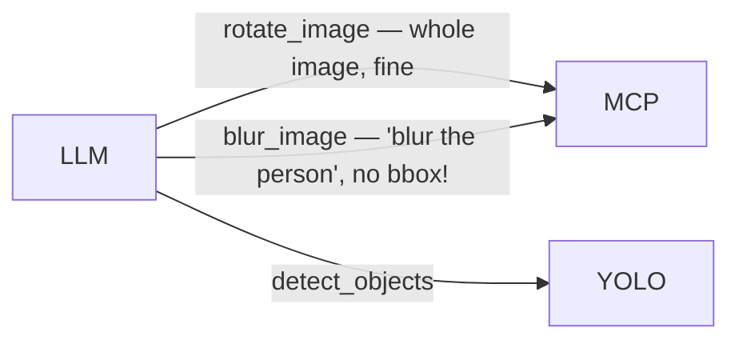
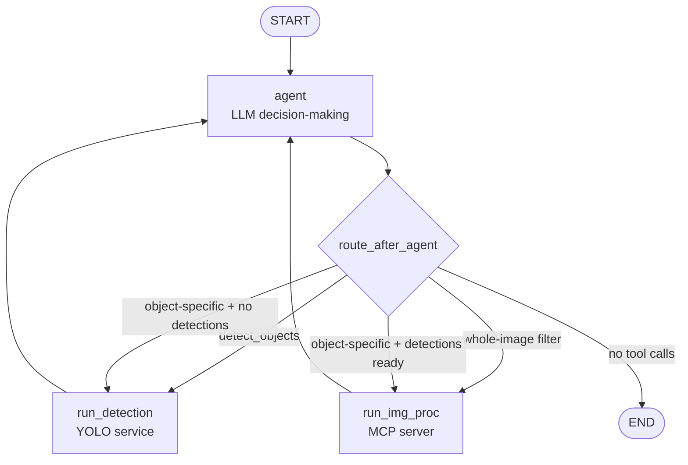
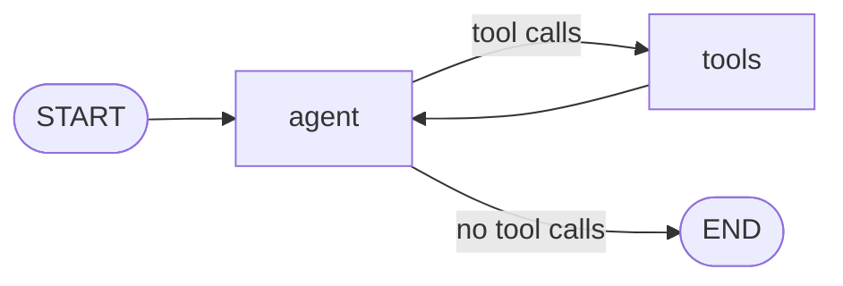

# AI Agents with LangGraph

In the previous tutorial you built a working agentic loop. As the task grows more complex, cracks appear.

### Hallucination

The agent responds *"I blurred the person in the image"* - but no tool was called. The model just said it did the work.

Or worse: it *did* call `blur_image` - but on the whole image, without bounding box data, because it skipped `detect_objects`. The user asked to blur a specific person; the agent blurred everything.

The natural fix is to add rules to the system prompt:

```
When the user refers to a specific object, call detect_objects first.
Only call blur_image with bounding box coordinates from a prior detection.
```

The agent still gets it wrong. These are just words. **You cannot enforce a workflow through a system prompt.**

### Conversation state

- Your agent crashes mid-task. State lives in Python variables - it's gone. Everything reruns from scratch.

- A user sends: *"Actually, don't blur anyone."*

  The blur is already applied and the original image is gone from context. The user has to resend it and re-specify every operation they still want. You've hit this in the PolyAI stack: tweak one filter, rebuild the whole request.

- A user asks: *"Before removing that person, show me a preview."*

  A `while` loop runs to completion or it doesn't. It can't pause and wait for a human - a graph can.

- *"Blur every child in this image except the one wearing red."*

  In a chain, the LLM must figure out the entire sequence through tool calls alone. Every complex request becomes a prompt engineering problem.


## The Transition

All of these problems share a root cause: **the LLM is responsible for controlling execution.**

The model looks at the conversation history and guesses the right next step. Most of the time it guesses correctly — but "most of the time" is not a guarantee.

LangGraph flips this. You define the structure. The LLM decides *what* to do. The graph decides *how execution flows*.

Detection must happen before filtering? Make it a graph edge — the LLM can't reach the filter node without passing through detection first. The model no longer needs to "remember" the rule; it's physically unreachable to violate it.

Two kinds of requests hit the PolyAI image pipeline:

- **Whole-image ops** — "rotate 90°", "flip horizontally". No detection needed.
- **Object-specific ops** — "blur the person", "crop the dog". Require bounding boxes from YOLO first.

In a chain, the LLM decides freely. Nothing stops it from calling `blur_image` on a "blur the person" request without ever running `detect_objects` — and the filter silently applies to the whole image.




## Thinking in LangGraph

LangGraph models an agent as a **stateful directed graph**. Building one always follows five steps.

### Step 1: Map Your Workflow as Discrete Steps

Identify the distinct operations in your process. Each becomes a **node** - a function that does one thing. Sketch how they connect.

For the PolyAI vision agent:



Some nodes always go to the same next node (static edges). Others decide based on state (conditional edges). The router can inspect `state["detections"]` to decide which path to take — that logic lives in your code, not in a prompt.

### Step 2: Identify What Each Step Needs to Do

For each node, ask: what kind of operation is this?

- **LLM step** - needs to understand, reason, or generate text
- **Data step** - needs to fetch from an external service (YOLO, a database)
- **Action step** - performs a real-world action (apply a filter, write to disk)
- **Human input step** - needs to pause and wait for a person

This tells you how to implement it and handle failures: LLM calls may need retries, action steps shouldn't be cached, human input steps pause indefinitely.

### Step 3: Design Your State

State is the shared notebook all nodes read from and write to. Every node receives it, does work, and returns updates.

- Needs to persist across steps? → **put it in state**
- Can be derived? → **compute on demand**

**Store raw data, not formatted text.** Format prompts inside nodes.

```python
from typing import Annotated, Optional
from typing_extensions import TypedDict
from langgraph.graph.message import add_messages
import operator

class VisionState(TypedDict):
    messages:           Annotated[list, add_messages]  # full conversation history
    image_b64:          Optional[str]                  # original image - always available
    detections:         Optional[dict]                 # YOLO output - never needs re-running
    filtered_image_b64: Optional[str]                  # latest processed image
    tools_called:       Annotated[list, operator.add]  # audit trail
```

`image_b64` stays in state forever - the original is never lost, and you never need to ask the user to resend it.

### Step 4: Build Your Nodes

A node is a Python function: takes state, returns a partial update.

```python
from langchain_core.messages import ToolMessage
import json

def agent_node(state: VisionState) -> dict:
    response = llm_with_tools.invoke(state["messages"])
    return {"messages": [response]}

def run_detection_node(state: VisionState) -> dict:
    last_message = state["messages"][-1]
    results = []
    detections = None

    for tc in last_message.tool_calls:
        if tc["name"] == "detect_objects":
            raw = detect_objects.invoke(tc)
            results.append(ToolMessage(content=str(raw), tool_call_id=tc["id"]))
            detections = json.loads(raw)

    return {
        "messages":     results,
        "detections":   detections,
        "tools_called": ["detect_objects"],
    }
```

If the agent crashes after this node, the graph resumes with detections already in state - no re-running YOLO.

### Step 5: Wire It Together

Connect nodes with edges and compile. A **router** inspects the last message and returns the next node name:

```python
from langgraph.graph import StateGraph, START, END

IMAGE_PROC_TOOL_NAMES  = {"blur_image", "crop_region", "rotate_image", "flip_image", "add_noise"}
# These tools operate on a specific object and require bounding boxes from detection
OBJECT_SPECIFIC_TOOLS = {"blur_image", "crop_region"}

def route_after_agent(state: VisionState) -> str:
    last = state["messages"][-1]

    if not getattr(last, "tool_calls", None):
        return END

    requested = {tc["name"] for tc in last.tool_calls}

    if "detect_objects" in requested:
        return "run_detection"

    if requested & IMAGE_PROC_TOOL_NAMES:
        # Object-specific tools need detections first — enforce it in the router
        if requested & OBJECT_SPECIFIC_TOOLS and not state.get("detections"):
            return "run_detection"
        return "run_img_proc"

    return END

graph = StateGraph(VisionState)

graph.add_node("agent",         agent_node)
graph.add_node("run_detection", run_detection_node)
graph.add_node("run_img_proc",  run_img_proc_node)

graph.add_edge(START, "agent")
graph.add_conditional_edges("agent", route_after_agent)
graph.add_edge("run_detection", "agent")
graph.add_edge("run_img_proc",  "agent")

app = graph.compile()
```

---

## The Simplest Starting Point

Here's the minimal LangGraph version of the `while` loop you already know.

### Install

```bash
pip install langgraph
```

### The Equivalent Graph

```python
import os
import requests
from langchain.chat_models import init_chat_model
from langchain_core.tools import tool
from langgraph.graph import StateGraph, MessagesState, START
from langgraph.prebuilt import ToolNode, tools_condition

os.environ["OPENAI_API_KEY"] = "sk-..."

@tool
def detect_objects() -> str:
    """Detect and identify objects in the image using YOLO object detection."""
    with open("beatles.jpeg", "rb") as f:
        response = requests.post("http://localhost:8080/predict", files={"file": f})
    return response.text

tools = [detect_objects]
llm = init_chat_model("openai:gpt-4o-mini")
llm_with_tools = llm.bind_tools(tools)

def agent(state: MessagesState):
    return {"messages": [llm_with_tools.invoke(state["messages"])]}

graph = StateGraph(MessagesState)
graph.add_node("agent", agent)
graph.add_node("tools", ToolNode(tools))           # dispatches all tool calls automatically

graph.add_edge(START, "agent")
graph.add_conditional_edges("agent", tools_condition)  # tool calls? → tools, else → END
graph.add_edge("tools", "agent")

app = graph.compile()

result = app.invoke({
    "messages": [
        {"role": "system", "content": "You are a helpful vision assistant."},
        {"role": "user",   "content": "How many people are in this image?"},
    ]
})
print(result["messages"][-1].content)
```

Identical behavior to your manual loop - but now you have a structure you can extend without rewriting the core.

Visualize it at any time:

```python
from IPython.display import Image, display
display(Image(app.get_graph().draw_mermaid_png()))
```



---

## What Changes When You Use a Graph

| Problem | Chain | Graph |
|---|---|---|
| Agent skips a required step | Happens - prompt rules don't prevent it | Impossible - the edge doesn't exist |
| Crash mid-execution | Start over from scratch | Resume from last checkpoint |
| "Undo" a filter | Original image lost, user must resend | `state["image_b64"]` always available |
| Pause for human approval | Not possible | `interrupt()` - pauses indefinitely |
| Complex conditional routing | LLM must figure it out | You define it in the router |

---

## Streaming and Persistence

**Stream** intermediate updates as nodes run:

```python
for chunk in app.stream(initial_state, stream_mode="updates"):
    node_name = list(chunk.keys())[0]
    print(f"[{node_name}] updated: {list(chunk[node_name].keys())}")
```

```
[agent]         updated: ['messages']
[run_detection] updated: ['messages', 'detections', 'tools_called']
[agent]         updated: ['messages']
[run_img_proc]  updated: ['messages', 'filtered_image_b64', 'tools_called']
```

**Persist** state across requests:

```bash
pip install langgraph-checkpoint-sqlite
```

```python
from langgraph.checkpoint.sqlite import SqliteSaver

checkpointer = SqliteSaver.from_conn_string("agent_memory.db")
app = graph.compile(checkpointer=checkpointer)

config = {"configurable": {"thread_id": "user-42"}}

app.invoke(initial_state,                                                    config=config)
app.invoke({"messages": [{"role": "user", "content": "Now rotate it 90°"}]}, config=config)
```

The second call picks up where the first left off - no resending state.

---

## Exercises

### :pencil2: Visualize Your Graph

```python
png_bytes = app.get_graph(xray=True).draw_mermaid_png()
with open("graph.png", "wb") as f:
    f.write(png_bytes)
```

`xray=True` expands sub-graphs like `ToolNode`.

---

### :pencil2: Iteration Guard

Add a guard - LangGraph has no built-in iteration limit:

```python
def route_after_agent(state: VisionState) -> str:
    if state.get("iteration_count", 0) >= 10:
        return END
    ...
```

---

### :pencil2: Human-in-the-Loop

LangGraph can pause before a node and wait for human approval:

```python
app = graph.compile(
    checkpointer=checkpointer,
    interrupt_before=["run_img_proc"],
)
```

The graph pauses when the LLM requests a filter. Inspect, approve, and resume:

```python
app.invoke(initial_state, config=config)       # runs until interrupt

pending = app.get_state(config).next
print("About to run:", pending)

app.invoke(None, config=config)                # resume
```

In your `/chat` endpoint: when the agent requests a destructive operation, respond `202 Accepted` and wait for frontend confirmation before resuming.

---

### :pencil2: Migrate the Agent Service

Update `services/agent/app.py` to use LangGraph. The `/chat` endpoint stays the same from the outside - only the internals change.

Make sure:
- `AgentResponse` still includes `tools_called`, `iterations`, `annotated_image`, and `agent_loop_time_s`
- `tools_called` comes from `result["tools_called"]` in the final graph state
- Existing tests still pass (mock `app.invoke` instead of `run_agent`)
