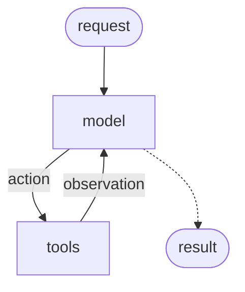

# AI Agents with LangChain

We will start building the AI agent from the ground up.


## Step I: the LLMs

We start at the point we all know well and love: the LLM.

No matter if it's GPT, Gemini, Claude, or even [a model you run locally](https://docs.ollama.com/quickstart), models can interpret and generate text, understand intent, translate languages, summarize, and answer questions without needing specialized training for each task.

With LangChain, you can easily call hundreds of models from all major providers.

Let's install the LangChain package and some of the most popular model providers:

```bash 
pip install langchain[openai] langchain[anthropic] langchain[google-genai]
```

To initialize a model:

```python
import os
from langchain.chat_models import init_chat_model

os.environ["OPENAI_API_KEY"] = "sk-..."

model = init_chat_model("openai:gpt-5.4-mini")
```

Then you can call the model with a prompt:

```python
response = model.invoke("Why do parrots talk?")
```

## Step II: Tool calling 

Did you know that in addition to text generation, many modern models can **request** to **call tools** that perform tasks such as fetching data from a database, searching the web, or running code?

Let's define a tool that calls the Yolo API:

```python
from langchain.tools import tool
import requests

@tool
def detect_objects() -> str:
    """Detect and identify objects in the image provided by the user using YOLO object detection."""

    image_file = ... # get the image file from the user input

    return requests.post("http://localhost:8080/predict", files={"file": image_file}).text
```

The `@tool` decorator converts the function into a tool that LangChain can use.

To make this tool available to the model, we pass it in the `tools` argument when creating the agent:

```python
import os
from langchain.chat_models import init_chat_model

os.environ["OPENAI_API_KEY"] = "sk-..."

model = init_chat_model("openai:gpt-5.4-mini")
model_with_tools = model.bind_tools([detect_objects])
```

Now, upon the following example user prompt `hey what do you see in the image attached to my message?`, the LLM model (assuming supporting tool calling), based on the conversation context, can return a response containing a specific *request* to invoke this tool function, including the arguments it wants to pass.


**Note that tools must be well-documented: informative and concise function’s docstring and typed argument names become part of the model's prompt.**


```python
response = model_with_tools.invoke("hey what do you see in the image attached to my message? SOME_IMG_BASE64_STRING")
for tool_call in response.tool_calls:
    if tool_call['name'] == "detect_objects":
        tool_response = detect_objects.invoke(tool_call)
```

## Agent = Model + Harness


An AI agent is a model calling tools in a loop until a given task is complete.



Your job as an agent developer is to create and manage the **harness**, i.e. get the right model, the right context at the right time for the given task.

A harness is everything around that loop:

- The model you choose to work with
- The prompts you provide
- The tools you provide
- Any middleware that shapes its behavior.


## Step III: The Agentic Loop

Here is a minimal, complete agentic loop:

```python
import os
import requests
from langchain.chat_models import init_chat_model
from langchain.tools import tool

os.environ["OPENAI_API_KEY"] = "sk-..."

@tool
def detect_objects() -> str:
    """Detect and identify objects in the image provided by the user using YOLO object detection."""
    with open("beatles.jpeg", "rb") as f:
        response = requests.post("http://localhost:8080/predict", files={"file": f})
    return response.text

llm = init_chat_model("openai:gpt-5.4-mini")
llm_with_tools = llm.bind_tools([detect_objects])

def run_agent(user_message: str) -> str:
    messages = [
        {"role": "system", "content": "You are a helpful vision assistant."},
        {"role": "user",   "content": user_message},
    ]

    while True:
        response = llm_with_tools.invoke(messages)
        messages.append(response)          # always record the model's reply

        # No tool calls → model has produced its final answer
        if not response.tool_calls:
            return response.content

        # Execute each tool the model requested
        for tool_call in response.tool_calls:
            if tool_call["name"] == "detect_objects":
                result = detect_objects.invoke(tool_call)
                messages.append({
                    "role": "tool",
                    "tool_call_id": tool_call["id"],
                    "content": str(result),
                })
        # Loop back: let the model see the tool results and decide what to do next

print(run_agent("How many people are in this image?"))
```

Two notes:

- Every model response goes into `messages`, even ones that only request tool calls. The model must see its own prior requests in the conversation history.
- The loop exits only when the model returns a reply with no tool calls - that is its final answer.

### Message Types

As can be seen, under the hood, LangChain sends the `messages` list to the LLM API as a plain JSON array. Each message has a **role** and a **content**.


Here is what the `messages` list actually looks like at each stage of the loop, in raw JSON form:

- After the first human message, before the first LLM call:

```json
[
  { "role": "system",    "content": "You are a helpful vision assistant." },
  { "role": "user",      "content": "How many people are in this image?" }
]
```

- After the model responds with a tool-call request (`AIMessage`):

```json
[
  { "role": "system",    "content": "You are a helpful vision assistant." },
  { "role": "user",      "content": "How many people are in this image?" },
  {
    "role": "assistant",
    "content": null,
    "tool_calls": [
      {
        "id": "call_abc123",
        "type": "function",
        "function": { "name": "detect_objects", "arguments": "{}" }
      }
    ]
  }
]
```

Note: `content` is `null` here - the model produced no text, only a tool-call request.

- After the tool result is appended:

```json
[
  { "role": "system",    "content": "You are a helpful vision assistant." },
  { "role": "user",      "content": "How many people are in this image?" },
  {
    "role": "assistant",
    "content": null,
    "tool_calls": [{ "id": "call_abc123", "function": { "name": "detect_objects", "arguments": "{}" } }]
  },
  {
    "role": "tool",
    "tool_call_id": "call_abc123",
    "content": "{\"detections\": [{\"label\": \"person\", \"score\": 0.95}, {\"label\": \"person\", \"score\": 0.88}]}"
  }
]
```

The `tool_call_id` ties the result back to the specific request - the model uses this to understand which tool call produced which result.

- Final model response:

```json
[
  ...,
  { "role": "assistant", "content": "There are 2 people in the image." }
]
```

This is when the loop exits and the agent returns the answer.


# Exercises

### :pencil2: Deploy the PolyAI System on Your EC2

PolyAI is a multi-service application: a `frontend` chat interface where you can upload images and ask questions about them, an LangChain `agent` that calls the `yolo` service you already built.

In this exercise you should deploy the whole system on your EC2.

#### Important implementation notes

- Use the same EC2 instance you used for the YOLO service. All services (`yolo`, `agent`, and `frontend`) should be run as Linux services.

- If you want, you can work **manually** on your dev instance, but the for prod instance, the `frontend` and `agent` (along with the existed `yolo`) services should be deployed **automatically, using your existed CD workflow**. For that, create a feature branch from `main` and modify your `.github/workflows/deploy.yml` workflow to deploy the `frontend` and `agent` services in addition to the `yolo` service. Then create a PR from your feature branch to `main` and merge it. If you've done everything correctly, the workflow should automatically deploy all three services on your prod EC2 instance.

- Better for your frontend app to be reachable at `<your-name>-dev.fursa.click:3000` instead of using the instance IP address.

- Don't forget to open required ports in your EC2 security group.

- For any required code changes, you must work according to our Git workflow: create a new branch from `main`, make your changes, merge to dev to test it there, create a PR to `main`. 

### :pencil2: Guard Against Infinite Loops

The current `run_agent` loop has no exit condition other than the model stopping tool calls. In theory, a confused model could call tools forever.

Add a `max_iterations` guard:

```python
def run_agent(history: list, max_iterations: int = 10) -> str:
    # your agentic loop code here
```

You can **manually** test it (in dev env only of course) by temporarily lowering `max_iterations` to `1` and sending a question that requires a tool call.


### :pencil2: Return the Annotated Image

Right now the agent only responds with text. But the YOLO service can also return the **predicted image** (the original photo with bounding boxes)

Make the agent include the annotated image in its response, either always after a detection (simple), or only when the user explicitly asks for it (a bit more interesting).

#### Important implementation notes

- You guess right, you must follow the Git workflow of our course - create a new feature branch for this feature. 

- You will need to make changes in both the `agent` and the `frontend` services. As the `frontend` service is Next.js/TypeScript (out of the course scope), use AI to navigate and modify it. We strongly recommend you to use "Ask mode" first, let it to explain the relevant changes. Make sure you understand the changes. We recommend install the [official Next.js agent skills](https://github.com/vercel-labs/next-skills). 


