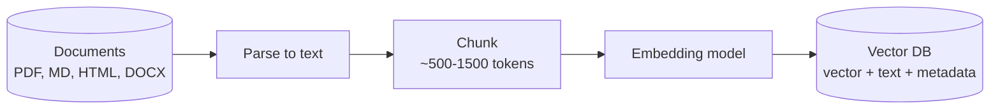
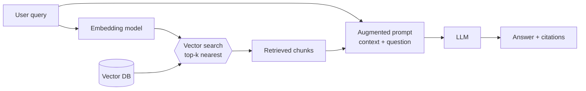

# Intro to RAG - Retrieval Augmented Generation

An LLM only knows what it saw during training. Ask it about your company's on-call runbook, last week's incident report, or the internal API your team shipped yesterday, and you get one of two bad outcomes: "I don't have information about that", or worse - a confident, fluent, completely invented answer.

**Retrieval Augmented Generation (RAG)** is the standard fix. Instead of teaching the model new facts, you *look the facts up* at question time and paste them into the prompt.

## Why not just fine-tune the model?

Fine tuning a model can be a heavy task. You need a lot of labeled data, and you have to retrain the model every time your knowledge changes. RAG is much lighter: you can add or remove documents without retraining, and you can use the same model for multiple knowledge bases.

Fine-tuning changes *how* the model behaves (tone, format, task style). RAG changes *what* the model knows. Most "the bot doesn't know our stuff" problems are RAG problems.

## The core idea

RAG has two phases: an **offline indexing** phase that runs when documents change, and an **online retrieval** phase that runs on every user query.

### Phase 1: Indexing

You cannot paste a 4000-page PDF into a prompt. So you cut documents into **chunks**, convert each chunk into a **vector embedding**, and store the vectors in a **vector database** alongside a pointer back to the original text.



An **embedding** is a fixed-length list of numbers that represents the *meaning* of a piece of text. Texts about similar topics land close together in that vector space, even when they share no words at all.

| Representation | Value |
|---|---|
| Text | "Kubernetes restarts a container when its liveness probe fails." |
| Embedding (1536-dim float32) | `[0.041, 0.056, -0.018, -0.012, -0.020, ...]` |

"Closeness" is usually **cosine similarity** - the angle between two vectors:

$$\text{sim}(a, b) = \frac{a \cdot b}{\lVert a \rVert \lVert b \rVert}$$

A value near $1$ means "about the same thing", near $0$ means unrelated. This is why RAG finds the right chunk when the user asks "why does my pod keep dying?" and the document says "liveness probe failure triggers a container restart" - zero shared keywords, high cosine similarity.

### Phase 2: Retrieval and generation

At query time the *same* embedding model converts the user's question into a vector, the vector DB returns the top-k nearest chunks, and those chunks are pasted into the prompt as context.



The prompt the LLM actually receives looks roughly like this:

```text
Answer the question using ONLY the context below.
If the context does not contain the answer, say you don't know.

<context>
[chunk 1 from k8s_pod_design.md] ...
[chunk 2 from k8s_core_objects.md] ...
</context>

Question: why does my pod keep restarting?
```

That last instruction is what turns a hallucination machine into a grounded one. The model is no longer recalling - it's reading.

> **The embedding model is a one-way commitment.** Documents and queries must be embedded by the *same* model, otherwise the vectors live in different spaces and similarity is meaningless. Changing the embedding model means re-embedding the entire corpus.

## Use cases

| Use case | What gets indexed | Why RAG fits |
|---|---|---|
| Internal docs assistant | Confluence, runbooks, ADRs | Private data, changes weekly |
| Customer support bot | Product docs, past tickets | Must cite the exact policy |
| Code assistant over a private repo | Source files, PR descriptions | Too large for a context window |
| Compliance / legal Q&A | Contracts, regulations | Answers must be traceable to a clause |
| Log & incident analysis | Post-mortems, alert history | "Have we seen this error before?" |

RAG is a poor fit when the question needs the *whole* corpus at once ("summarize all 900 tickets") or when the answer requires computation rather than lookup ("what was Q3 revenue?" - that's a SQL tool call, not a vector search).

## Demo: RAG with LightRAG

[LightRAG](https://github.com/HKUDS/LightRAG) is a lightweight, self-contained RAG server with a REST API and a Web UI. Its default storage backends are plain files - no Postgres, no Elasticsearch, no vector DB to provision. You bring a model provider and a document; it does the rest.

We'll use **AWS Bedrock** for both the LLM and the embeddings. 

### Get the project and configure it

```bash
git clone https://github.com/HKUDS/LightRAG.git
cd LightRAG
cp env.example .env
```

Edit `.env`. The two things that matter are the LLM binding and the embedding binding:

```bash
### LLM
LLM_BINDING=bedrock
LLM_BINDING_HOST=DEFAULT_BEDROCK_ENDPOINT
LLM_MODEL=us.anthropic.claude-haiku-4-5-20251001-v1:0

### Embeddings
EMBEDDING_BINDING=bedrock
EMBEDDING_BINDING_HOST=DEFAULT_BEDROCK_ENDPOINT
EMBEDDING_MODEL=amazon.titan-embed-text-v2:0
EMBEDDING_DIM=1024

### Bedrock endpoints are regional
AWS_REGION=us-east-1
```


### Give the container your AWS credentials

LightRAG has some limitation reading your `~/.aws/credentials` file, even when mounted properly. The easiest way to give it credentials is to export them as environment variables (**without copy & pasting your secret keys into the `.env` file**):

```bash 
export $(aws configure export-credentials --profile default --format env-no-export | xargs)
```

Then add the following to `docker-compose.yml`:

```yaml
services:
  lightrag:
    environment:
      - AWS_ACCESS_KEY_ID=${AWS_ACCESS_KEY_ID}
      - AWS_SECRET_ACCESS_KEY=${AWS_SECRET_ACCESS_KEY}
```

### Run it

```bash
docker compose up
```

Open http://localhost:9621 - the Web UI lets you upload documents, watch the indexing pipeline, query, and visualize the knowledge graph LightRAG builds.


### Index a document

Upload something you actually want to ask questions about. A tutorial from this repo is a good test:

```bash
curl -X POST http://localhost:9621/documents/upload \
  -F "file=@tutorials/k8s_pod_design.md"
```

Watch the pipeline in the Web UI. The document gets parsed, chunked, embedded, and - this is LightRAG's twist - an LLM also extracts **entities and relationships** into a knowledge graph.

### Ask a question

```bash
curl -X POST http://localhost:9621/query \
  -H "Content-Type: application/json" \
  -d '{"query": "How do liveness and readiness probes differ?", "mode": "naive"}'
```

Try the same question with different `mode` values:

| Mode | What it retrieves |
|---|---|
| `naive` | Classic RAG - top-k chunks by vector similarity only |
| `local` | Entities from the knowledge graph and their attributes |
| `global` | Relationship chains across documents - good for "how does X relate to Y?" |
| `mix` | All of the above merged (LightRAG's default) |

Start with `naive` - that is textbook RAG, exactly the flow in the diagram above. Then compare it to `mix` on a question that spans two documents.


